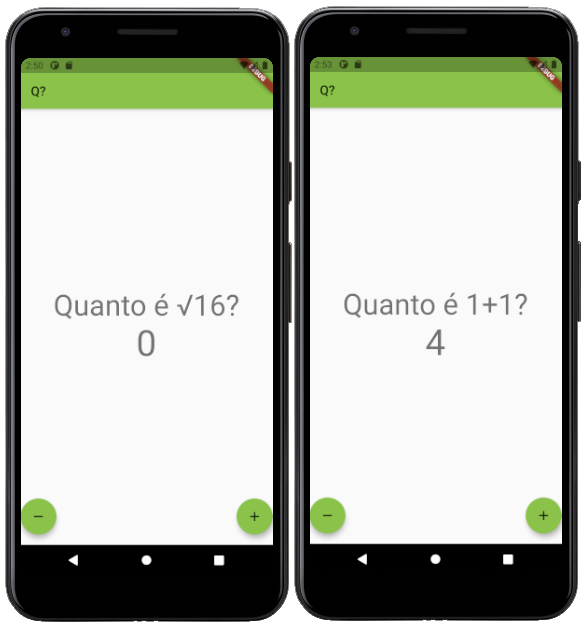

# Quiz matemático usando flutter?

Teste seus conhecimentos sobre matemática num aplicativo simples e intuitivo. Utilize o botão "+" para incrementar e o botão "-" para decrementar o contador até que ele se iguale a resposta correta para a pergunta.

## Q?

